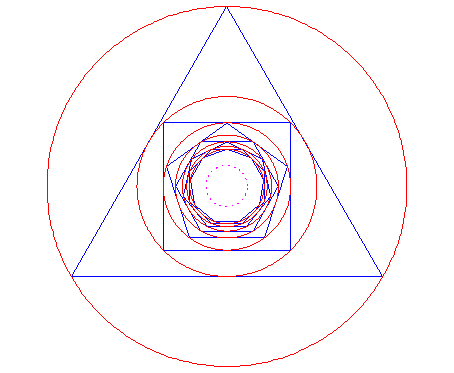

# kepler-bouwkamp
https://en.wikipedia.org/wiki/Kepler%E2%80%93Bouwkamp_constant

In plane geometry, the Kepler–Bouwkamp constant (or polygon inscribing constant) is obtained as a limit of the following sequence. Take a circle of radius 1. Inscribe a regular triangle in this circle. Inscribe a circle in this triangle. Inscribe a square in it. Inscribe a circle, regular pentagon, circle, regular hexagon and so forth. The radius of the limiting circle is called the Kepler–Bouwkamp constant.[1] It is named after Johannes Kepler and Christoffel Bouwkamp [de], and is the inverse of the polygon circumscribing constant.

